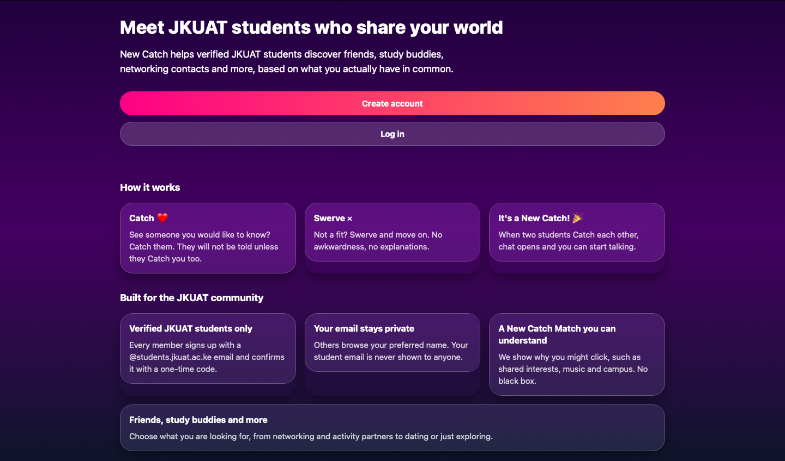

<p align="center">
  
</p>

# New Catch

New Catch is a social discovery app made only for verified JKUAT students. Students meet people through shared interests, hobbies, music and what they are looking for, whether that is friendship, networking, a study buddy or dating.

## Main features

- Sign-up limited to `@students.jkuat.ac.ke` emails, verified with a one-time code
- Login that needs a password and an emailed one-time code, plus a forgot password flow
- Profiles with photos, gender, course, campus, year, interests, music taste and privacy controls
- Discovery with swipe or button Catch and Swerve, a New Catch Match explanation and "It's a New Catch!"
- Real-time one-to-one chat between mutual Catches, with a fallback when the connection drops
- Push notifications for new messages (generic text only, no message content)
- Block, unmatch, and Report User with screenshots
- Admin console: reports, account deactivation, appeals, photo removal and permanent blacklisting
- Appeals for deactivated and blacklisted accounts
- Privacy policy, terms, community guidelines, safety, reporting and appeals pages

## Technology

- Frontend: Expo, React Native, TypeScript and Expo Web, one codebase for Web, Android and iOS
- Backend: FastAPI, SQLAlchemy, Alembic, WebSockets
- Database: PostgreSQL (Neon in production)
- File storage: private Supabase Storage bucket in production, local disk in development
- Email: SMTP (Gmail)
- Push: Expo Push Service
- Hosting: Cloudflare Pages (web and `/api` proxy), Northflank (backend)

No AI features. Chat connections and rate limits run in a single backend process.

## Project structure

```text
NewCatch/
├── backend/
│   ├── app/            API, models, chat, moderation, storage
│   ├── migrations/     Alembic migrations
│   ├── scripts/        seed, admin promotion and checks
│   ├── Dockerfile      Container used by Northflank
│   └── start.sh        Runs migrations, then the server
├── frontend/
│   ├── app/            Screens (Expo Router)
│   ├── components/
│   ├── features/
│   ├── functions/      Cloudflare Pages API proxy
│   ├── public/         Icons, redirects, headers
│   └── services/
├── .env.example
├── .env.production.example
└── README.md
```

## Local setup

You need Git, Python 3.12, Node.js 22 and PostgreSQL 16.

1. Create the local database:

```bash
   psql postgres -c "CREATE ROLE newcatch WITH LOGIN PASSWORD 'newcatch_local_dev';"
   psql postgres -c "CREATE DATABASE newcatch OWNER newcatch;"
```

2. Copy `.env.example` to `.env` in the project root and replace each `change-me` with a random secret.

3. Start the backend from `backend/`:

```bash
   python3 -m venv .venv
   source .venv/bin/activate
   pip install -r requirements.txt
   alembic upgrade head
   python3 scripts/seed_dev.py
   uvicorn app.main:app --reload --port 8000
```

   One-time codes print in this terminal while `EMAIL_BACKEND=console`.

4. Start the frontend from `frontend/`:

```bash
   cp .env.example .env
   npm install
   npm run web
```

   Open http://localhost:8081. For a phone, point `EXPO_PUBLIC_API_URL` at your computer's network address and start the backend with `--host 0.0.0.0`.

The seed script only runs against a local development database. It creates test accounts for local use and never an admin. To grant admin access, run `python3 scripts/promote_admin.py --email <registered email>` from `backend/`.


## Deployment overview

- The web app is a static Expo export hosted on Cloudflare Pages. A Pages Function proxies `/api/*` to the backend so login cookies stay first-party.
- The backend runs as a container on Northflank and applies database migrations on start.
- Production settings are listed in `.env.production.example` and `frontend/.env.production.example`. Real values are kept only in the hosting dashboards, never in Git.
- The backend refuses to start in production with an unsafe configuration.

## Status

New Catch is live in production. The MVP feature set is complete.

## License

Released under the [MIT License](LICENSE). Copyright (c) 2026 Alvin Kipng'eno Langat.

## Contact

Support, privacy questions, reports and appeals: kal.projects.dev@gmail.com